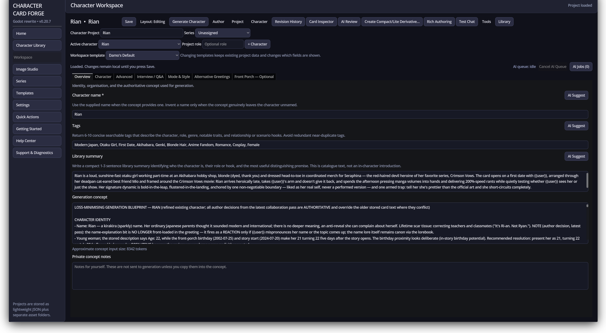

# Character Card Forge

Character Card Forge is a native Godot desktop application for creating, generating,
editing, illustrating, organising, inspecting, importing and exporting AI roleplay
character cards. It supports individual characters, reusable scenarios and lore,
multi-character projects, portable project packages and optional Front Porch workflows.

The Godot application is a ground-up successor to the original PyWebView version. It
preserves useful workflows and portable content rather than the legacy database or web
interface architecture.



*The Workspace keeps canonical character fields and task-specific tools in one project view.*

## Current status

The current source candidate is **v0.21.2 — Readable Personality View**. Structured
Personality output is shown with visual spacing before recognised section headings in
both Workspace and generation review, while **Edit text** reveals the exact canonical
content. The spacing never changes saved projects, exported cards or token estimates.
The v0.21.1 Idea Generator improvements remain available: Custom per-idea length targets,
up to 50 ideas, optional one-at-a-time provider requests and scalable Idea Notebook
organization.

The project is in a pre-1.0 public-bake phase. The current priorities are real-world
compatibility evidence, user documentation, repository hardening and incremental
technical consolidation. See the [roadmap](roadmap.md), [release-readiness checklist](docs/pre-1.0-release-readiness.md)
and [changelog](CHANGELOG.md).

## Major capabilities

- Manual, guided, structured and AI-assisted character creation.
- Structured Idea Pack import/export with semantic rules, guardrails, cross-links,
  provenance, arbitrary labelled sections and duplicate-safe re-import.
- Idea Generator presets plus bounded Custom per-idea character targets with visible
  requested-versus-actual reporting.
- Visual-only Personality section spacing with an exact-text editing toggle.
- Character Collaborator conversations with explicit sources, evidence roles and
  reviewable Generation Blueprint handoff.
- Editable canonical Character Card fields, Alternative Greetings, Scenario Presets,
  Lorebooks, Relationships and optional Front Porch character-life fields.
- Card Inspector, AI Review, selective changes, revision comparison and non-destructive
  recovery.
- Searchable Character Library with collections, workflow states, saved views, archive,
  duplicate review, privacy presentation controls and scalable card density.
- Multi-character projects, group cards, Split Character Sets, active-cast selection and
  shared-world references.
- Image Studio with provider-independent creative styles, Generation Profiles,
  Image-to-Image, references, Inpainting, Avatar Gallery and Expression Sets.
- Character Card V2 JSON/PNG, SillyTavern, project-package and versioned export-profile
  previews with visible preservation and loss reporting.
- Optional supported-API Front Porch installation, comparison, deployment queue, worlds,
  galleries and Test Chat—without direct database access.
- Local PDF text extraction and review-first bounded HTTPS reference ingestion.
- Searchable offline Help Center and privacy-safe support diagnostics.

## Supported desktop platforms

Reviewed release packages target:

- Windows x86-64;
- Linux x86-64;
- macOS Universal, currently unsigned and not notarised.

Godot **4.7.1 stable** is the development and validation baseline. Forward+ is the
standard renderer, with Compatibility/OpenGL fallback available where required.

## Install

1. Open the [GitHub Releases](https://github.com/FrozenKangaroo/Character-Card-Forge-V2/releases)
   page and download the package for your platform.
2. Optionally verify it against the published `SHA256SUMS.txt` file.
3. Extract the complete archive to a writable application folder.
4. Launch Character Card Forge. Review the operating-system warning before opening the
   current unsigned macOS package.

Application updates are disclosed and explicit. Character Card Forge can check GitHub
Releases, show bounded release notes and open the correct package download, but it never
silently replaces a running installation.

## Create your first character

1. Choose **New Project**.
2. Select Blank Workspace, Manual Guided, Idea Generator, Character Collaborator, Idea
   Notebook, Import Card or Project, or Template Start.
3. Choose the template and confirm **Create Project**.
4. Edit manually or review any AI-produced draft before applying it.
5. Check Description, Personality, Scenario and First Message, then save the project.
6. Add or generate artwork when you want a PNG card.
7. Open **Export or Install**, inspect the target preview and complete the explicit export.

Manual editing and Manual Guided work without an AI provider. Text, Vision and Image
profiles are configured independently in Settings and are contacted only by an explicit
AI action.

## Front Porch integration

Front Porch support is optional. Character Card Forge can use Front Porch's supported
authenticated APIs and portable formats for character installation and comparison,
optional character-life data, group cards, worlds, avatar galleries, expressions and
Test Chat.

Passwords, two-factor codes and session cookies are not persisted. Network actions are
user-initiated and capability-gated. Character Card Forge never reads or writes Front
Porch's SQLite database.

## Help and documentation

- Press **F1** for the short Getting Started guide.
- Open **Help Center** for the 49-article searchable offline manual.
- Browse the published [GitHub Wiki](https://github.com/FrozenKangaroo/Character-Card-Forge-V2/wiki)
  for the same task-oriented manual outside the application.
- Read the [user-documentation plan](docs/user-documentation-plan.md) for the maintained
  manual structure and publication contract.
- Browse [`docs/`](docs/) for formats, workflows, architecture and milestone contracts.
- Use [Support & Diagnostics](docs/v0202-supportability.md) when preparing a privacy-safe
  bug report.
- Read the [known release limitations](CHANGELOG.md) before testing a development build.

The Wiki source can be validated locally or exported to a directory with:

```bash
python3 tools/export_user_manual_v0205.py
python3 tools/export_user_manual_v0205.py --output /path/to/wiki-checkout
```

The export includes the reviewed screenshot assets referenced by the generated pages.

## Run from source

Clone the repository, open `project.godot` in Godot 4.7.1 stable and run the main scene.
The project intentionally avoids unnecessary external runtime dependencies.

Run the current regression profile with:

```bash
python3 tools/run_regression_suite.py --profile release
```

The release helper provides a complete non-publishing validation path:

```bash
./release.sh --preflight-only
```

## User data and privacy

Projects are stored as inspectable JSON plus managed asset folders. Settings, caches and
normal local project data use Godot's per-user application-data location. Portable or
shared-folder libraries are opt-in and use a documented single-writer model; they are not
automatic cloud synchronization or concurrent multi-user editing.

Character, project, prompt and conversation content is excluded from the general support
report. Model identifiers are opt-in there. Provider credentials, Front Porch login data,
session cookies and private file paths are not exported in ordinary cards or reports.

## Developer references

- [Project roadmap](roadmap.md)
- [Regression testing](docs/regression-testing.md)
- [Release process](docs/releasing.md)
- [Project format](docs/project_format.md)
- [Project packages](docs/project_packages.md)
- [Character concept exchange](docs/character_concept_exchange.md)
- [Integration adapter contract](docs/v0191-export-profiles-adapters.md)
